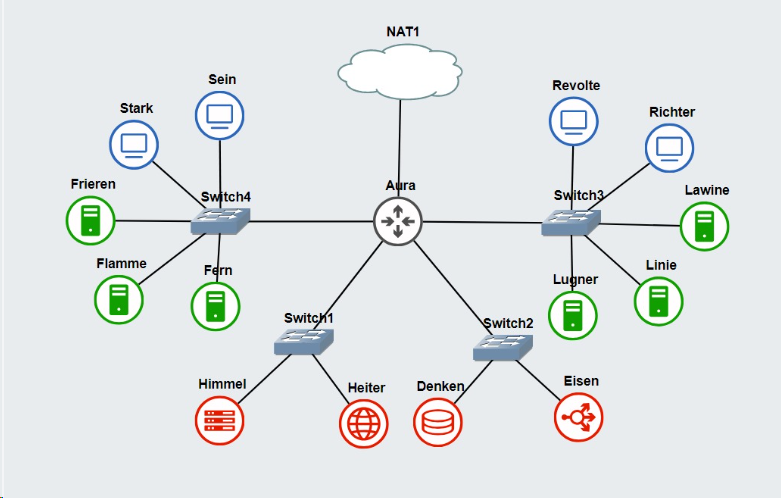

# Jarkom-Modul-3-D17-2023

**Praktikum Jaringan Komputer Modul 3 Tahun 2023**

## Author
| Nama | NRP |Github |
|---------------------------|------------|--------|
|Adam Haidar Azizi | 5025211114 | https://github.com/HADAIZI |
|Ahda Filza Ghaffaru | 5025211144 | https://github.com/Ahdaaa |

# Laporan Resmi
## Daftar Isi
- [Laporan Resmi](#laporan-resmi)
  - [Daftar Isi](#daftar-isi)
  - [Topologi](#topologi)
  - [Config](#config)
  - [List Script Node](#List-Script-Node)
- [Soal 1](#Soal-1)
  - [Solution](#solution)
  - [Result](#result)
- [Soal 2](#Soal-2)
  - [Solution](#solution-1)
- [Soal 3](#Soal-3)
  - [Solution](#solution-2)
- [Soal 4](#Soal-4)
  - [Solution](#solution-3)
  - [Result](#result-1)
- [Soal 5](#Soal-5)
  - [Solution](#solution-4)
  - [Result](#result-2)
- [Soal 6](#Soal-6)
  - [Solution](#solution-5)
  - [Result](#result-3)
- [Soal 7](#Soal-7)
  - [Solution](#solution-6)
  - [Result](#result-4)
- [Soal 8](#Soal-8)
  - [Solution](#solution-7)
  - [Result](#result-5)
- [Soal 9](#Soal-9)
  - [Solution](#solution-8)
  - [Result](#result-6)
- [Soal 10](#Soal-10)
  - [Solution](#solution-9)
  - [Result](#result-7)
- [Soal 11](#Soal-11)
  - [Solution](#solution-10)
  - [Result](#result-8)
- [Soal 12](#Soal-12)
  - [Solution](#solution-11)
  - [Result](#result-9)
- [Soal 13](#Soal-13)
  - [Solution](#solution-12)
  - [Result](#result-10)
- [Soal 14](#Soal-14)
  - [Solution](#solution-13)
  - [Result](#result-11)
- [Soal 15](#Soal-15)
  - [Solution](#solution-14)
  - [Result](#result-12)
- [Soal 16](#Soal-16)
  - [Solution](#solution-15)
  - [Result](#result-13)
- [Soal 17](#Soal-17)
  - [Solution](#solution-16)
  - [Result](#result-14)
- [Soal 18](#Soal-18)
  - [Solution](#solution-17)
  - [Result](#result-15)
- [Soal 19](#Soal-19)
  - [Solution](#solution-18)
  - [Result](#result-16)
- [Soal 20](#Soal-20)
  - [Solution](#solution-19)
  - [Result](#result-17)

## Topologi


## Config
- **Aura (DHCP Relay)**
```
auto eth0
iface eth0 inet dhcp
up iptables -t nat -A POSTROUTING -o eth0 -j MASQUERADE -s 10.30.0.0/16

auto eth1
iface eth1 inet static
	address 10.30.1.0
	netmask 255.255.255.0

auto eth2
iface eth2 inet static
	address 10.30.2.0
	netmask 255.255.255.0

auto eth3
iface eth3 inet static
	address 10.30.3.0
	netmask 255.255.255.0

auto eth4
iface eth4 inet static
	address 10.30.4.0
	netmask 255.255.255.0
```

- **Himmel (DHCP Server)**
```
auto eth0
iface eth0 inet static
	address 10.30.1.1
	netmask 255.255.255.0
	gateway 10.30.1.0

```

- **Heiter (DNS Server)**
```
auto eth0
iface eth0 inet static
	address 10.30.1.2
	netmask 255.255.255.0
	gateway 10.30.1.0
```
- **Denken (Database Server)**
```
auto eth0
iface eth0 inet dhcp
hwaddress ether 2a:b9:20:f6:fd:c9
```
- **Eisen (Load Balancer)**
```
auto eth0
iface eth0 inet dhcp
hwaddress ether a6:06:02:c2:28:a4
```
- **Frieren (Laravel Worker)**
```
auto eth0
iface eth0 inet dhcp
hwaddress ether 16:8c:a3:19:91:3b
```
- **Flamme (Laravel Worker)**
```
auto eth0
iface eth0 inet dhcp
hwaddress ether 4e:2d:5c:c8:e6:80
```
- **Fern (Laravel Worker)**
```
auto eth0
iface eth0 inet dhcp
hwaddress ether a2:d9:1e:52:fd:ff
```
- **Lawine (PHP Worker)**
```
auto eth0
iface eth0 inet dhcp
hwaddress ether a2:eb:f1:be:9b:65
```
- **Linie (PHP Worker)**
```
auto eth0
iface eth0 inet dhcp
hwaddress ether 36:33:94:64:ef:cc
```
- **Lugner (PHP Worker)**
```
auto eth0
iface eth0 inet dhcp
hwaddress ether a2:9e:52:b8:ec:7c
```
- **Revolte, Richter, Sein, dan Stark (Client)**
```
auto eth0
iface eth0 inet dhcp
```

### List Script Node Pada Root
- **Aura**
```sh
apt-get update
apt-get install isc-dhcp-relay -y
service isc-dhcp-relay start

echo '
SERVERS="10.30.1.1"
INTERFACES="eth1 eth2 eth3 eth4"
OPTIONS=""
' > /etc/default/isc-dhcp-relay

echo '
net.ipv4.ip_forward=1
' > /etc/sysctl.conf

service isc-dhcp-relay restart
```
- **Himmel**
```sh
apt update
apt install isc-dhcp-server -y

echo '
INTERFACESv4="eth0"
INTERFACESv6=""
' > /etc/default/isc-dhcp-server

echo '
subnet 10.30.1.0 netmask 255.255.255.0 {
}
subnet 10.30.2.0 netmask 255.255.255.0 {
    option routers 10.30.2.0;
    option broadcast-address 10.30.2.255;
    option domain-name-servers 10.30.1.2;
}
subnet 10.30.3.0 netmask 255.255.255.0 {
    range 10.30.3.16 10.30.3.32;
    range 10.30.3.64 10.30.3.80;
    option routers 10.30.3.0;
    option broadcast-address 10.30.3.255;
    option domain-name-servers 10.30.1.2;
    default-lease-time 180;
    max-lease-time 5760;
}

subnet 10.30.4.0 netmask 255.255.255.0 {
    range 10.30.4.12 10.30.4.20;
    range 10.30.4.160 10.30.4.168;
    option routers 10.30.4.0;
    option broadcast-address 10.30.4.255;
    option domain-name-servers 10.30.1.2;
    default-lease-time 720;
    max-lease-time 5760;
}

host Lugner {
    hardware ethernet a2:9e:52:b8:ec:7c;
    fixed-address 10.30.3.1;
}

host Linie {
    hardware ethernet 36:33:94:64:ef:cc;
    fixed-address 10.30.3.2;
}

host Lawine {
    hardware ethernet a2:eb:f1:be:9b:65;
    fixed-address 10.30.3.3;
}

host Fern {
    hardware ethernet a2:d9:1e:52:fd:ff;
    fixed-address 10.30.4.1;
}

host Flamme {
    hardware ethernet 4e:2d:5c:c8:e6:80;
    fixed-address 10.30.4.2;
}

host Frieren {
    hardware ethernet 16:8c:a3:19:91:3b;
    fixed-address 10.30.4.3;
}

host Denken {
    hardware ethernet 2a:b9:20:f6:fd:c9;
    fixed-address 10.30.2.1;
}

host Eisen {
    hardware ethernet a6:06:02:c2:28:a4;
    fixed-address 10.30.2.2;
}

' > /etc/dhcp/dhcpd.conf

service isc-dhcp-server stop
service isc-dhcp-server start

```

- **Heiter**
```sh
apt-get update
apt-get install bind9 -y

echo '
zone "riegel.canyon.d17.com" {
       type master;
       file "/etc/bind/jarkom/riegel.canyon.d17.com";
};

zone "granz.channel.d17.com" {
    type master;
    file "/etc/bind/jarkom/granz.channel.d17.com";
};

zone "3.30.10.in-addr.arpa" {
    type master;
    file "/etc/bind/jarkom/3.30.10.in-addr.arpa";
};

' > /etc/bind/named.conf.local

mkdir /etc/bind/jarkom

cp /etc/bind/db.local /etc/bind/jarkom/riegel.canyon.d17.com
cp /etc/bind/db.local /etc/bind/jarkom/granz.channel.d17.com

echo '
;
; BIND data file for local loopback interface
;
$TTL    604800
@       IN      SOA     riegel.canyon.d17.com. root.riegel.canyon.d17.com. (
                     2022100601         ; Serial
                         604800         ; Refresh
                          86400         ; Retry
                        2419200         ; Expire
                         604800 )       ; Negative Cache TTL
;
@       IN      NS      riegel.canyon.d17.com.
@       IN      A       10.30.4.1       ; IP Node Fern
www     IN      CNAME   riegel.canyon.d17.com.
@       IN      AAAA    ::1
' > /etc/bind/jarkom/riegel.canyon.d17.com

echo '
;
; BIND data file for local loopback interface
;
$TTL    604800
@       IN      SOA     granz.channel.d17.com. root.granz.channel.d17.com. (
                     2022100601         ; Serial
                         604800         ; Refresh
                          86400         ; Retry
                        2419200         ; Expire
                         604800 )       ; Negative Cache TTL
;
@       IN      NS      granz.channel.d17.com.
@       IN      A       10.30.3.1       ; IP Node Lugner
www     IN      CNAME   granz.channel.d17.com.
@       IN      AAAA    ::1
' > /etc/bind/jarkom/granz.channel.d17.com

cp /etc/bind/db.local /etc/bind/jarkom/3.30.10.in-addr.arpa

echo '
;
; BIND data file for local loopback interface
;
$TTL    604800
@       IN      SOA     granz.channel.d17.com. root.granz.channel.d17.com. (
                     2022100601         ; Serial
                         604800         ; Refresh
                          86400         ; Retry
                        2419200         ; Expire
                         604800 )       ; Negative Cache TTL
;
3.30.10.in-addr.arpa.   IN      NS      granz.channel.d17.com.
1                       IN      PTR     granz.channel.d17.com.  ; Byte ke-4 Lugner
' > /etc/bind/jarkom/3.30.10.in-addr.arpa

echo '
options {
    directory "/var/cache/bind";

    forwarders {
        192.168.122.1;
    };

    allow-query{any;};
    auth-nxdomain no;       # conform to RFC1035
    listen-on-v6 { any; };
};
' > /etc/bind/named.conf.options
service bind9 restart

```
- **Denken**
```sh
apt-get update
apt-get install mariadb-server -y
service mysql restart

mysql <<EOF
CREATE USER 'kelompokd17'@'%' IDENTIFIED BY 'passwordd17';
CREATE USER 'kelompokd17'@'localhost' IDENTIFIED BY 'passwordd17';
CREATE DATABASE dbkelompokd17;
GRANT ALL PRIVILEGES ON *.* TO 'kelompokd17'@'%';
GRANT ALL PRIVILEGES ON *.* TO 'kelompokd17'@'localhost';
FLUSH PRIVILEGES;
EOF

echo '
[client-server]

!includedir /etc/mysql/conf.d/
!includedir /etc/mysql/mariadb.conf.d/

[mysqld]
skip-networking=0
skip-bind-address
' > /etc/mysql/my.cnf

echo '
[server]

[mysqld]

user                    = mysql
pid-file                = /run/mysqld/mysqld.pid
socket                  = /run/mysqld/mysqld.sock
#port                   = 3306
basedir                 = /usr
datadir                 = /var/lib/mysql
tmpdir                  = /tmp
lc-messages-dir         = /usr/share/mysql
#skip-external-locking

# Instead of skip-networking the default is now to listen only on
# localhost which is more compatible and is not less secure.
bind-address            = 0.0.0.0

query_cache_size        = 16M

query_cache_size        = 16M

log_error = /var/log/mysql/error.log

expire_logs_days        = 10

character-set-server  = utf8mb4
collation-server      = utf8mb4_general_ci

[embedded]

[mariadb]

[mariadb-10.3]
' > /etc/mysql/mariadb.conf.d/50-server.cnf

service mysql restart
```
- **Eisen**
```sh
apt-get update
apt-get install nginx -y
apt-get install htop -y
service nginx start

touch /etc/nginx/sites-available/lb-granz
mkdir /etc/nginx/rahasiakita

echo '
netics:$apr1$sWc7lqUh$WZtJIOErQKS/ydaCV46ft1
' > /etc/nginx/rahasiakita/.htpasswd

echo '
# Default menggunakan Round Robin
upstream backend  {
    server 10.30.3.1 weight=4; # IP Lugner
    server 10.30.3.2 weight=2; # IP Linie
    server 10.30.3.3 weight=1; # IP Lawine
}

server {
    listen 80;
    server_name granz.channel.d17.com;

    location / {
        allow 10.30.3.69;
        allow 10.30.3.70;
        allow 10.30.4.167;
        allow 10.30.4.168;
        deny all;

        proxy_pass http://backend;
        proxy_set_header    X-Real-IP $remote_addr;
        proxy_set_header    X-Forwarded-For $proxy_add_x_forwarded_for;
        proxy_set_header    Host $http_host;

        auth_basic "Administrator'/'''s Area";
        auth_basic_user_file /etc/nginx/rahasiakita/.htpasswd;
    }

    location ~ /\.ht {
        deny all;
    }

    location /its {
         allow 10.30.3.69;
        allow 10.30.3.70;
        allow 10.30.4.167;
        allow 10.30.4.168;
        deny all;

        proxy_pass https://www.its.ac.id;

        auth_basic "Administrator/s Area";
        auth_basic_user_file /etc/nginx/rahasiakita/.htpasswd;
    }

    error_log /var/log/nginx/lb_error.log;
    access_log /var/log/nginx/lb_access.log;
}
' > /etc/nginx/sites-available/lb-granz

echo '
# Default menggunakan Round Robin
upstream backend-laravel  {
    server 10.30.4.1:8001; # IP Fern
    server 10.30.4.2:8002; # IP Flamme
    server 10.30.4.3:8003; # IP Frieren
}

server {
    listen 81;
    server_name riegel.canyon.d17.com;

    location /Fern/ {
        proxy_bind 10.30.2.2;
        proxy_pass http://10.30.4.1:8001;
    }

    location /Flamme/ {
        proxy_bind 10.30.2.2;
        proxy_pass http://10.30.4.2:8002;
    }

    location /Frieren/ {
        proxy_bind 10.30.2.2;
        proxy_pass http://10.30.4.3:8002;
    }

    location / {
        proxy_pass http://backend-laravel;
        proxy_set_header    X-Real-IP $remote_addr;
        proxy_set_header    X-Forwarded-For $proxy_add_x_forwarded_for;
        proxy_set_header    Host $http_host;

    }

    error_log /var/log/nginx/lb_error.log;
    access_log /var/log/nginx/lb_access.log;
}
' > /etc/nginx/sites-available/lb-riegel

ln -s /etc/nginx/sites-available/lb-granz /etc/nginx/sites-enabled
ln -s /etc/nginx/sites-available/lb-riegel /etc/nginx/sites-enabled
rm -rf /etc/nginx/sites-enabled/default
service nginx restart

```

- **Frieren, Flamme, Fern (Kurg Lebih Sama)**
```sh
apt-get update

apt-get install -y lsb-release ca-certificates apt-transport-https software-properties-common gnupg2

curl -sSLo /usr/share/keyrings/deb.sury.org-php.gpg https://packages.sury.org/php/apt.gpg

sh -c 'echo "deb [signed-by=/usr/share/keyrings/deb.sury.org-php.gpg] https://packages.sury.org/php/ $(lsb_release -sc) main" > /etc/apt/sources.list.d/php.list'

apt-get update

apt-get install php8.0-mbstring php8.0-xml php8.0-cli php8.0-common php8.0-intl php8.0-opcache php8.0-readline php8.0-mysql php8.0-fpm php8.0-curl unzip wget -y

apt-get install nginx -y

wget https://getcomposer.org/download/2.0.13/composer.phar

chmod +x composer.phar

mv composer.phar /usr/bin/composer

apt-get install --reinstall tzdata

apt-get install git -y

cd /var/www

git clone https://github.com/martuafernando/laravel-praktikum-jarkom.git

cd laravel-praktikum-jarkom

composer update
composer install

cd /var/www/laravel-praktikum-jarkom

cp .env.example .env

echo '
APP_NAME=Laravel
APP_ENV=local
APP_KEY=
APP_DEBUG=true
APP_URL=http://localhost

LOG_CHANNEL=stack
LOG_DEPRECATIONS_CHANNEL=null
LOG_LEVEL=debug

DB_CONNECTION=mysql
DB_HOST=10.30.2.1
DB_PORT=3306
DB_DATABASE=dbkelompokd17
DB_USERNAME=kelompokd17
DB_PASSWORD=passwordd17

BROADCAST_DRIVER=log
CACHE_DRIVER=file
FILESYSTEM_DISK=local
QUEUE_CONNECTION=sync
SESSION_DRIVER=file
SESSION_LIFETIME=120

MEMCACHED_HOST=127.0.0.1

REDIS_HOST=127.0.0.1
REDIS_PASSWORD=null
REDIS_PORT=6379

MAIL_MAILER=smtp
MAIL_HOST=mailpit
MAIL_PORT=1025
MAIL_USERNAME=null
MAIL_PASSWORD=null
MAIL_ENCRYPTION=null
MAIL_FROM_ADDRESS="hello@example.com"
MAIL_FROM_NAME="${APP_NAME}"

AWS_ACCESS_KEY_ID=
AWS_SECRET_ACCESS_KEY=
AWS_DEFAULT_REGION=us-east-1
AWS_BUCKET=
AWS_USE_PATH_STYLE_ENDPOINT=false

PUSHER_APP_ID=
PUSHER_APP_KEY=
PUSHER_APP_SECRET=
PUSHER_HOST=
PUSHER_PORT=443
PUSHER_SCHEME=https
PUSHER_APP_CLUSTER=mt1

VITE_PUSHER_APP_KEY="${PUSHER_APP_KEY}"
VITE_PUSHER_HOST="${PUSHER_HOST}"
VITE_PUSHER_PORT="${PUSHER_PORT}"
VITE_PUSHER_SCHEME="${PUSHER_SCHEME}"
VITE_PUSHER_APP_CLUSTER="${PUSHER_APP_CLUSTER}"
' > /var/www/laravel-praktikum-jarkom/.env

php artisan key:generate
php artisan config:cache
php artisan migrate:fresh
php artisan db:seed
php artisan storage:link
php artisan jwt:secret
php artisan config:clear

echo '
server {

    listen 8003;

    root /var/www/laravel-praktikum-jarkom/public;

    index index.php index.html index.htm;
    server_name riegel.canyon.d17.com;

    location / {
            try_files $uri $uri/ /index.php?$query_string;
    }

    # pass PHP scripts to FastCGI server
    location ~ \.php$ {
    include snippets/fastcgi-php.conf;
    fastcgi_pass unix:/var/run/php/php8.0-fpm.sock;
    }

    location ~ /\.ht {
            deny all;
    }

    error_log /var/log/nginx/implementasi_error.log;
    access_log /var/log/nginx/implementasi_access.log;
}
' > /etc/nginx/sites-available/riegel.canyon.d17

ln -s /etc/nginx/sites-available/riegel.canyon.d17 /etc/nginx/sites-enabled/

chown -R www-data.www-data /var/www/laravel-praktikum-jarkom/storage

service php8.0-fpm start
service nginx start

apt-get install lynx -y

echo '[www]
user = www-data
group = www-data
listen = /run/php/php8.0-fpm.sock
listen.owner = www-data
listen.group = www-data
php_admin_value[disable_functions] = exec,passthru,shell_exec,system
php_admin_flag[allow_url_fopen] = off

; Choose how the process manager will control the number of child processes.

pm = dynamic
pm.max_children = 25
pm.start_servers = 12
pm.min_spare_servers = 8
pm.max_spare_servers = 15

' > /etc/php/8.0/fpm/pool.d/www.conf

service php8.0-fpm restart

```
- **Lawine, Lugner, Linie (PHP Worker)**
```sh
apt-get update
apt-get install nginx -y
apt-get install php php-fpm -y
apt-get install wget -y
apt-get install unzip -y

mkdir /var/www/granz.channel.d17

wget -O /var/www/granz.channel.d17/granz.channel.yyy.com.zip "https://drive.google.com/u/0/uc?id=1ViSkRq7SmwZgdK64eRbr5Fm1EGCTPrU1&export=download"

unzip -d /var/www/granz.channel.d17 /var/www/granz.channel.d17/granz.channel.yyy.com.zip && rm /var/www/granz.channel.d17/granz.channel.yyy.com.zip

mv /var/www/granz.channel.d17/modul-3/css /var/www/granz.channel.d17
mv /var/www/granz.channel.d17/modul-3/js /var/www/granz.channel.d17
mv /var/www/granz.channel.d17/modul-3/index.php /var/www/granz.channel.d17
mv /var/www/granz.channel.d17/modul-3/info.php /var/www/granz.channel.d17

rm -r /var/www/granz.channel.d17/modul-3

touch /etc/nginx/sites-available/granz.channel.d17

echo '
server {
    listen 80;

    root /var/www/granz.channel.d17;

    index index.php index.html index.htm;
    server_name granz.channel.d17.com;

    location / {
                    try_files $uri $uri/ /index.php?$query_string;
    }

    # pass PHP scripts to FastCGI server
    location ~ \.php$ {
        include snippets/fastcgi-php.conf;
        fastcgi_pass unix:/var/run/php/php7.3-fpm.sock;
    }

    location ~ /\.ht {
                    deny all;
    }
  error_log /var/log/nginx/granz_channel_d17.log;
    access_log /var/log/nginx/granz_channel_d17.log;
}
' > /etc/nginx/sites-available/granz.channel.d17

ln -s /etc/nginx/sites-available/granz.channel.d17 /etc/nginx/sites-enabled

rm -rf /etc/nginx/sites-enabled/default

service nginx restart
service php7.3-fpm start
service php7.3-fpm restart

```
- **Revolte**
```sh
echo nameserver 192.168.122.1 >> /etc/resolv.conf
apt-get update
apt-get install dnsutils -y
apt-get install lynx -y
apt-get install apache2-utils -y

echo '
auto eth0
iface eth0 inet dhcp
' > /etc/network/interfaces
```

- **Richter**
```sh
echo nameserver 192.168.122.1 >> /etc/resolv.conf
apt-get update
apt-get install lynx -y
apt-get install dnsutils -y
apt-get install apache2-utils -y
```
- **Sein**
```sh
echo nameserver 192.168.122.1 >> /etc/resolv.conf
apt-get update
apt-get install lynx -y
apt-get install dnsutils -y
apt-get install apache2-utils -y
```
- **Stark**
```sh
#echo nameserver 192.168.122.1 > /etc/resolv.conf
apt-get update
apt-get install dnsutils -y
apt-get install apache2-utils -y
apt-get install lynx -y

echo '
{
    "username": "kelompokd17",
    "password": "passwordd17"
}
' > /root/register.json

echo '
{
    "username": "kelompokd17",
    "password": "passwordd17"
}
' > /root/login.json

apt-get install jq -y
```

## Soal 1
>Lakukan konfigurasi sesuai dengan peta yang sudah diberikan.

### Solution
Pertama-tama, kami melakukan persiapan konfigurasi topologi dan setup sesuai dengan aturan yang telah diberikan. Untuk kebutuhan pengujian, kami menambahkan domain register berupa riegel.canyon.d17.com untuk worker Laravel dan granz.channel.d17.com untuk worker PHP yang mengarah pada worker dengan IP 10.30.x.1. Karena pada konfigurasi topologi sebelumnya seluruh worker sudah menggunakan DHCP, maka kami melakukan modifikasi pada node Lugner dan Fern seperti berikut:

- **Lugner (PHP Worker)**
```
auto eth0
iface eth0 inet static
	address 10.30.3.1
	netmask 255.255.255.0
	gateway 10.30.3.0

```
- **Fern (Laravel Worker)**
```
auto eth0
iface eth0 inet static
	address 10.30.4.1
	netmask 255.255.255.0
	gateway 10.30.4.0
```

Selanjutnya, pada DNS Server (Heiter), kami menjalankan perintah berikut:
```sh
echo 'zone "riegel.canyon.d17.com" {
    type master;
    file "/etc/bind/sites/riegel.canyon.d17.com";
};

zone "granz.channel.d17.com" {
    type master;
    file "/etc/bind/sites/granz.channel.d17.com";
};

zone "10.in-addr.arpa" {
    type master;
    file "/etc/bind/sites/10.in-addr.arpa";
};' > /etc/bind/named.conf.local

mkdir -p /etc/bind/sites
cp /etc/bind/db.local /etc/bind/sites/riegel.canyon.d17.com
cp /etc/bind/db.local /etc/bind/sites/granz.channel.d17.com
cp /etc/bind/db.local /etc/bind/sites/10.in-addr.arpa

echo ';
; BIND data file for local loopback interface
;
$TTL    604800
@       IN      SOA     riegel.canyon.d17.com. root.riegel.canyon.d17.com. (
                        2023111401      ; Serial
                         604800         ; Refresh
                          86400         ; Retry
                        2419200         ; Expire
                         604800 )       ; Negative Cache TTL
;
@       IN      NS      riegel.canyon.d17.com.
@       IN      A       10.30.4.1     ; IP Fern
www     IN      CNAME   riegel.canyon.d17.com.' > /etc/bind/sites/riegel.canyon.d17.com

echo ';
; BIND data file for local loopback interface
;
$TTL    604800
@       IN      SOA     granz.channel.d17.com. root.granz.channel.d17.com. (
                        2023111401      ; Serial
                         604800         ; Refresh
                          86400         ; Retry
                        2419200         ; Expire
                         604800 )       ; Negative Cache TTL
;
@       IN      NS      granz.channel.d17.com.
@       IN      A       10.30.3.1     ; IP Lugner
www     IN      CNAME   granz.channel.d17.com.' > /etc/bind/sites/granz.channel.d17.com

echo 'options {
      directory "/var/cache/bind";

      forwarders {
              192.168.122.1;
      };

      allow-query{any;};
      auth-nxdomain no;
      listen-on-v6 { any; };
}; ' >/etc/bind/named.conf.options

service bind9 start
```

## Soal 2
> Client yang melalui Switch3 mendapatkan range IP dari [prefix IP].3.16 - [prefix IP].3.32 dan [prefix IP].3.64 - [prefix IP].3.80 (2)

### Solution
Konfigurasi Himmel:
```sh
subnet 10.30.3.0 netmask 255.255.255.0 {
    range 10.30.3.16 10.30.3.32;
    range 10.30.3.64 10.30.3.80;
    option routers 10.30.3.0;
    option broadcast-address 10.30.3.255;
    option domain-name-servers 10.30.1.2;
    default-lease-time 180;
    max-lease-time 5760;
}
```
Pada konfigurasi di atas, rentang IP dari [prefix IP].3.16 hingga [prefix IP].3.32 dan [prefix IP].3.64 hingga [prefix IP].3.80 telah ditentukan. Klien yang terhubung melalui Switch3 dan menggunakan layanan DHCP dari Himmel akan diberikan alamat IP dari rentang tersebut.

Klien yang terhubung melalui Switch3 akan secara otomatis mendapatkan alamat IP dari rentang yang telah ditentukan pada konfigurasi di atas. Sebagai contoh, jika ada klien yang terhubung, ia akan diberikan alamat IP seperti 10.30.3.17 atau 10.30.3.65, sesuai dengan rentang yang telah ditentukan.

### Result

## Soal 3
> Client yang melalui Switch4 mendapatkan range IP dari [prefix IP].4.12 - [prefix IP].4.20 dan [prefix IP].4.160 - [prefix IP].4.168 (3)
### Solution
Klien yang terhubung melalui Switch4 akan mendapatkan rentang IP dari [prefix IP].4.12 hingga [prefix IP].4.20 dan [prefix IP].4.160 hingga [prefix IP].4.168. Konfigurasi DHCP pada Himmel (DHCP Server) telah disesuaikan untuk memberikan rentang IP tersebut kepada klien.

Konfigurasi Himmel:
```sh
subnet 10.30.3.0 netmask 255.255.255.0 {
    range 10.30.3.16 10.30.3.32;
    range 10.30.3.64 10.30.3.80;
    option routers 10.30.3.0;
    option broadcast-address 10.30.3.255;
    option domain-name-servers 10.30.1.2;
    default-lease-time 180;
    max-lease-time 5760;
}
```
Pada konfigurasi di atas, rentang IP dari [prefix IP].4.12 hingga [prefix IP].4.20 dan [prefix IP].4.160 hingga [prefix IP].4.168 telah ditentukan. Klien yang terhubung melalui Switch4 dan menggunakan layanan DHCP dari Himmel akan diberikan alamat IP dari rentang tersebut.

## Soal 4

### Solution
Untuk memastikan bahwa klien dapat terhubung ke internet melalui DNS yang disediakan oleh Heiter dan mendapatkan konfigurasi seperti `option broadcast-address` dan `option domain-name-servers`, berikut adalah langkah-langkah dan konfigurasi yang dilakukan pada klien:

1. Konfigurasi DHCP Server
Tambahkan beberapa konfigurasi pada file `/etc/dhcp/dhcpd.conf` pada DHCP Server (Heiter):

```sh
subnet 10.30.3.0 netmask 255.255.255.0 {
    range 10.30.3.16 10.30.3.32;
    range 10.30.3.64 10.30.3.80;
    option routers 10.30.3.0;
    option broadcast-address 10.30.3.255;
    option domain-name-servers 10.30.1.2;
}

subnet 10.30.4.0 netmask 255.255.255.0 {
    range 10.30.4.12 10.30.4.20;
    range 10.30.4.160 10.30.4.168;
    option routers 10.30.4.0;
    option broadcast-address 10.30.4.255;
    option domain-name-servers 10.30.1.2;
}
```

2. Konfigurasi Shell Script
Tambahkan script pada shell untuk melakukan konfigurasi pada DHCP Server:

```sh
echo 'subnet 10.30.1.0 netmask 255.255.255.0 {
}

subnet 10.30.2.0 netmask 255.255.255.0 {
}

subnet 10.30.3.0 netmask 255.255.255.0 {
    range 10.30.3.16 10.30.3.32;
    range 10.30.3.64 10.30.3.80;
    option routers 10.30.3.0;
    option broadcast-address 10.30.3.255;
    option domain-name-servers 10.30.1.2;
}

subnet 10.30.4.0 netmask 255.255.255.0 {
    range 10.30.4.12 10.30.4.20;
    range 10.30.4.160 10.30.4.168;
    option routers 10.30.4.0;
    option broadcast-address 10.30.4.255;
    option domain-name-servers 10.30.1.2;
} ' > /etc/dhcp/dhcpd.conf

service isc-dhcp-server start
```

3. Konfigurasi DHCP Relay
Tambahkan konfigurasi pada file `/etc/default/isc-dhcp-relay` pada setiap DHCP Relay (Lugner dan Fern):

```sh
echo '# Defaults for isc-dhcp-relay initscript
# sourced by /etc/init.d/isc-dhcp-relay
# installed at /etc/default/isc-dhcp-relay by the maintainer scripts

#
# This is a POSIX shell fragment
#

# What servers should the DHCP relay forward requests to?
SERVERS="10.30.1.1"

# On what interfaces should the DHCP relay (dhrelay) serve DHCP requests?
INTERFACES="eth1 eth2 eth3 eth4"

# Additional options that are passed to the DHCP relay daemon?
OPTIONS=""' > /etc/default/isc-dhcp-relay

service isc-dhcp-relay start 
```

Pastikan juga bahwa `net.ipv4.ip_forward` diaktifkan pada file `/etc/sysctl.conf` pada setiap DHCP Relay.

4. Restart Client
Terakhir, pastikan untuk merestart seluruh klien agar dapat melakukan leasing IP dari DHCP Server.

Dengan melakukan langkah-langkah tersebut, klien seharusnya dapat mendapatkan DNS dari Heiter dan terhubung dengan internet melalui DNS tersebut.

## Soal 5
> Lama waktu DHCP server meminjamkan alamat IP kepada Client yang melalui Switch3 selama 3 menit sedangkan pada client yang melalui Switch4 selama 12 menit. Dengan waktu maksimal dialokasikan untuk peminjaman alamat IP selama 96 menit (5)
### Solution
1. Konfigurasi DHCP Server
Tambahkan konfigurasi waktu peminjaman alamat IP pada file /etc/dhcp/dhcpd.conf pada DHCP Server (Heiter):
```
echo 'subnet 10.30.1.0 netmask 255.255.255.0 {
}

subnet 10.30.2.0 netmask 255.255.255.0 {
}

subnet 10.30.3.0 netmask 255.255.255.0 {
    range 10.30.3.16 10.30.3.32;
    range 10.30.3.64 10.30.3.80;
    option routers 10.30.3.0;
    option broadcast-address 10.30.3.255;
    option domain-name-servers 10.30.1.2;
    default-lease-time 180; # 3 menit
    max-lease-time 5760;   # 96 menit
}

subnet 10.30.4.0 netmask 255.255.255.0 {
    range 10.30.4.12 10.30.4.20;
    range 10.30.4.160 10.30.4.168;
    option routers 10.30.4.0;
    option broadcast-address 10.30.4.255;
    option domain-name-servers 10.30.1.2;
    default-lease-time 720; # 12 menit
    max-lease-time 5760;    # 96 menit
} ' > /etc/dhcp/dhcpd.conf

service isc-dhcp-server start

```
Dengan melakukan langkah-langkah tersebut, lama waktu peminjaman alamat IP dapat diatur sesuai dengan kebutuhan, yaitu 3 menit untuk Client melalui Switch3 dan 12 menit untuk Client melalui Switch4. Waktu maksimal peminjaman alamat IP adalah 96 menit.

## Soal 6
>Pada masing-masing worker PHP, lakukan konfigurasi virtual host untuk website berikut dengan menggunakan php 7.3. 
### Solution

Konfigurasi Linie, Lugner, dan Lawine (PHP Worker):
```sh
echo '
server {
    listen 80;

    root /var/www/granz.channel.d17;

    index index.php index.html index.htm;
    server_name granz.channel.d17.com;

    location / {
        try_files $uri $uri/ /index.php?$query_string;
    }

    # pass PHP scripts to FastCGI server
    location ~ \.php$ {
        include snippets/fastcgi-php.conf;
        fastcgi_pass unix:/var/run/php/php7.3-fpm.sock;
    }

    location ~ /\.ht {
        deny all;
    }

    error_log /var/log/nginx/granz_channel_d17.log;
    access_log /var/log/nginx/granz_channel_d17.log;
}
' > /etc/nginx/sites-available/granz.channel.d17

ln -s /etc/nginx/sites-available/granz.channel.d17 /etc/nginx/sites-enabled

service nginx restart
service php7.3-fpm start
service php7.3-fpm restart

```
### Result

## Soal 7
>   Kepala suku dari Bredt Region memberikan resource server sebagai berikut:
    Lawine, 4GB, 2vCPU, dan 80 GB SSD.
    Linie, 2GB, 2vCPU, dan 50 GB SSD.
    Lugner 1GB, 1vCPU, dan 25 GB SSD.
    aturlah agar Eisen dapat bekerja dengan maksimal, lalu lakukan testing dengan 1000 request dan 100 request/second. (7)
### Solution
Pertama, kita akan melakukan konfigurasi pada Eisen, sebagai resource server dari Bredt Region. Sesuaikan sumber daya server (Lawine, Linie, dan Lugner) sesuai dengan alokasi yang diberikan.
```sh
echo '
upstream backend  {
    server 10.30.3.1 weight=4 max_fails=2 fail_timeout=30s; # IP Lugner
    server 10.30.3.2 weight=2 max_fails=2 fail_timeout=30s; # IP Linie
    server 10.30.3.3 weight=1 max_fails=2 fail_timeout=30s; # IP Lawine
}

server {
    listen 80;

    location / {
        proxy_pass http://backend;
        proxy_set_header    X-Real-IP $remote_addr;
        proxy_set_header    X-Forwarded-For $proxy_add_x_forwarded_for;
        proxy_set_header    Host $http_host;
    }

    error_log /var/log/nginx/eisen_error.log;
    access_log /var/log/nginx/eisen_access.log;
}
' > /etc/nginx/sites-available/eisen

ln -s /etc/nginx/sites-available/eisen /etc/nginx/sites-enabled/

service nginx restart
```

### Result 
Tes pada klien (Revolte) dengan 
```sh
ab -n 1000 -c 100 http://www.granz.channel.d17.com/ 
```

## Soal 8
>    Karena diminta untuk menuliskan grimoire, buatlah analisis hasil testing dengan 200 request dan 10 request/second masing-masing algoritma Load Balancer dengan     ketentuan sebagai berikut:
    Nama Algoritma Load Balancer
    Report hasil testing pada Apache Benchmark
    Grafik request per second untuk masing masing algoritma. 
    Analisis (8)

**Algoritma Round Robin**

1. Lakukan konfigurasi load balancer (Eisen) di directory ``/etc/nginx/sites-available/lb-granz``, dengan cara memodifikasi upstream agar memiliki algoritma round robin. Berikut adalah potongan kode yang perlu ditambahkan

```sh
# Default menggunakan Round Robin
upstream backend  {
    server 10.30.3.1; # IP Lugner
    server 10.30.3.2; # IP Linie
    server 10.30.3.3; # IP Lawine
}
```

2. Lalu, pada client lakukan testing dengan apache benchmark ke ``IP Load Balancer`` dengan cara berikut,

```sh
ab -n 200 -c 10 http://10.30.2.2/
```

3. Berikut adalah screenshot hasil benchmark-nya,

**Algoritma IP Hash**

1. Lakukan konfigurasi load balancer (Eisen) di directory ``/etc/nginx/sites-available/lb-granz``, dengan cara memodifikasi upstream agar memiliki algoritma round robin. Berikut adalah potongan kode yang perlu ditambahkan

```sh
ip_hash;
upstream backend  {
    server 10.30.3.1; # IP Lugner
    server 10.30.3.2; # IP Linie
    server 10.30.3.3; # IP Lawine
}
```

2. Lalu, pada client lakukan testing dengan apache benchmark ke ``IP Load Balancer`` dengan cara berikut,

```sh
ab -n 200 -c 10 http://10.30.2.2/
```

3. Berikut adalah screenshot hasil benchmark-nya,

**Algoritma Least Connection**

1. Lakukan konfigurasi load balancer (Eisen) di directory ``/etc/nginx/sites-available/lb-granz``, dengan cara memodifikasi upstream agar memiliki algoritma round robin. Berikut adalah potongan kode yang perlu ditambahkan

```sh
least_conn;
upstream backend  {
    server 10.30.3.1; # IP Lugner
    server 10.30.3.2; # IP Linie
    server 10.30.3.3; # IP Lawine
}
```

2. Lalu, pada client lakukan testing dengan apache benchmark ke ``IP Load Balancer`` dengan cara berikut,

```sh
ab -n 200 -c 10 http://10.30.2.2/
```

3. Berikut adalah screenshot hasil benchmark-nya,

**Algoritma Generic Hash**

1. Lakukan konfigurasi load balancer (Eisen) di directory ``/etc/nginx/sites-available/lb-granz``, dengan cara memodifikasi upstream agar memiliki algoritma round robin. Berikut adalah potongan kode yang perlu ditambahkan

```sh
hash $request_uri consistent;
upstream backend  {
    server 10.30.3.1; # IP Lugner
    server 10.30.3.2; # IP Linie
    server 10.30.3.3; # IP Lawine
}
```

2. Lalu, pada client lakukan testing dengan apache benchmark ke ``IP Load Balancer`` dengan cara berikut,

```sh
ab -n 200 -c 10 http://10.30.2.2/
```

3. Berikut adalah screenshot hasil benchmark-nya,

## Soal 9
>    Dengan menggunakan algoritma Round Robin, lakukan testing dengan menggunakan 3 worker, 2 worker, dan 1 worker sebanyak 100 request dengan 10 request/second, kemudian tambahkan grafiknya pada grimoire. 